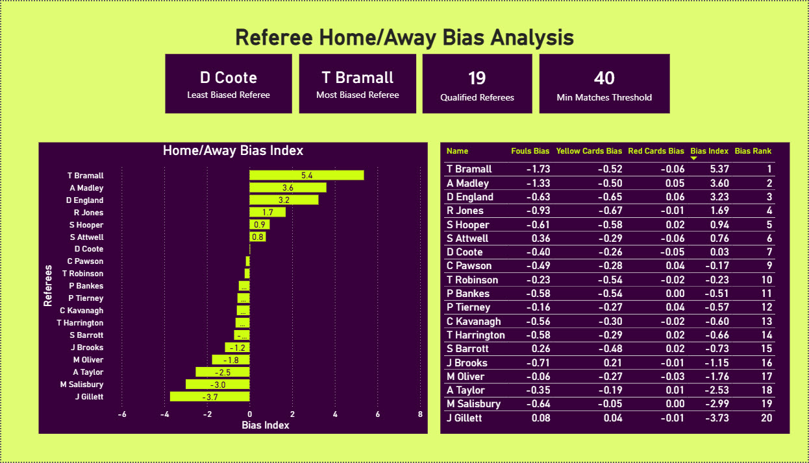
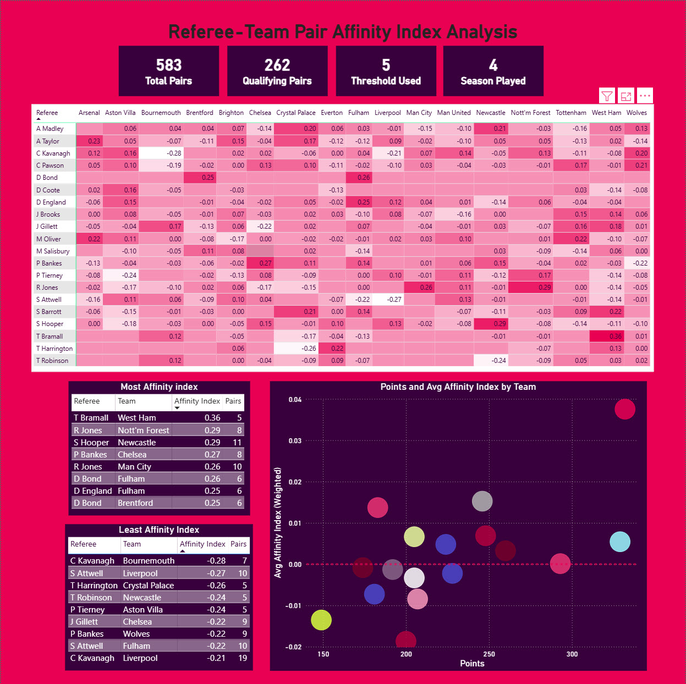
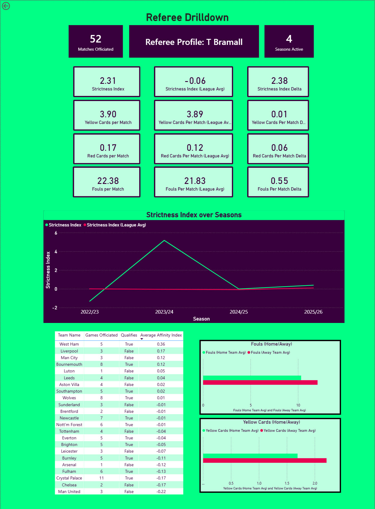

# English-Premier-League-Referee-Analytics-Dashboard
A Power BI + PostgreSQL project analyzing four seasons of Premier League officiating to answer a simple question: do referees actually treat matches, teams, and home/away sides consistently?

## Overview

This project analyzes the last four English Premier League seasons (2022/23–2025/26) to answer a set of questions about referee behavior that don't usually get looked at systematically: which officials are stricter or more lenient than their peers, whether individual referees show measurable bias between home and away teams, and whether specific referee-team pairings show patterns that hold up once small-sample noise is accounted for.

Rather than relying on an existing disciplinary points system (like the FA's), every ranking in this dashboard is built from a composite index derived directly from the underlying match data, with weights calculated from the data itself rather than assumed in advance. The project goes end-to-end: raw CSVs → a modeled PostgreSQL warehouse → SQL-based exploration → an interactive Power BI dashboard.

## Data Source

- Raw match data from [football-data.co.uk](https://www.football-data.co.uk/), covering the last four EPL seasons (2022/23–2025/26).
- Modeled as a star schema in PostgreSQL:
  - `fact_match` — 1,520 rows, one row per match
  - `fact_team_match` — 3,040 rows, one row per team per match (built by unpivoting `fact_match`)
  - `dim_team`, `dim_date`, `dim_season`, `dim_referee` — supporting dimension tables

## Tech Stack

- **PostgreSQL** — data warehousing, CSV import/cleaning, exploratory SQL (joins, CTEs, window functions)
- **Power BI** — data modeling, relationships, dashboard design
- **DAX** — composite index calculations, ranking logic, drillthrough filtering

## Methodology

- **Strictness Index** — a composite z-score combining fouls, yellow cards, and red cards per match, calculated only for referees with 40+ matches officiated in the dataset, to keep small-sample officials from dominating the rankings.
- **Home/Away Bias Index** — measures the gap between how a referee treats the home team versus the away team, using the same three underlying components.
- **Referee–Team Affinity Index** — for each referee-team pair with enough shared matches, measures how that pairing's cards and fouls deviate from the referee's overall average. Component weights (fouls, yellows, reds) were derived from the variance in the data itself rather than borrowed from an external scoring system, and small-sample pairs are shrunk toward zero so a real pattern isn't mistaken for one built on a handful of games.
- **Qualifying thresholds** — minimum-match cutoffs (40 matches for referee-level rankings, 5 shared matches for referee-team pairs) are applied throughout so rankings reflect real patterns rather than small-sample noise.

## Key Findings

- The strictest referee overall, **D. Coote**, stood out by a wide margin above every other qualifying official — notably, he was later removed from PGMOL's officiating roster following a conduct investigation, an unusual real-world footnote behind the numbers.
- More experienced referees tend to officiate more leniently, on average, than newer officials.
- Several referees show a meaningful home/away bias, with a substantial swing on the Bias Index between the most home-favoring and most neutral officials.
- **Arsenal** faced the strictest officiating of any club in the dataset, driven mainly by **A. Taylor** and **M. Oliver**, both of whom rank among the harshest referees Arsenal faced across the four seasons.
- **S. Attwell** and **C. Kavanagh** show the sharpest team-specific split of any referees studied — both notably lenient with Liverpool while ranking among the strictest officials Manchester United faced.

## Dashboard Walkthrough

### 1. Referee Strictness Analysis

This page ranks every qualifying referee (40+ matches) by a composite Strictness Index built from fouls, yellow cards, and red cards per match. The scatter plot maps average fouls per match against average cards per match, split into quadrants like "by the book" and "hands off," with bubble size representing total matches officiated. D. Coote emerges as the strictest official by a wide margin, while J. Gillett is the most lenient. The ranked table breaks the composite score down into its individual components so any ranking can be traced back to what's actually driving it.

### 2. Referee Home/Away Bias Analysis

This page measures whether referees treat home and away teams differently, using a Bias Index built from the gap between home-team and away-team fouls, yellows, and reds under each official. Referees are ranked from most home-favoring to most neutral, making imbalances easy to spot at a glance. T. Bramall shows the largest measurable bias, while D. Coote's index sits closest to zero, making him the most neutral referee in the dataset by this measure. Because the index is directional, it captures not just how biased a referee is but which side benefits.

### 3. Referee–Team Pair Affinity Index Analysis

This page investigates whether individual referees officiate specific teams differently from their own overall average, using a shrinkage-adjusted Affinity Index so small-sample pairings don't distort the picture. The heatmap matrix covers every referee-team pair with at least 5 shared matches, alongside "most" and "least" affinity leaderboards for pairs that hold up after shrinkage. A. Taylor and M. Oliver stand out for consistently stricter-than-average officiating of Arsenal, while S. Attwell and C. Kavanagh show the opposite pattern — lenient with Liverpool, strict with Manchester United. A supporting scatter plot cross-references each team's season points against its average affinity index, to check whether stronger teams tend to get different treatment.

### 4. Single Referee Drillthrough

This page lets any referee from the other three pages be inspected individually — right-click a referee row and drill through to open their profile, filtered automatically. KPI cards compare that referee's strictness, cards, and fouls per match directly against the league average, with deltas showing the size and direction of the gap. A season-by-season trend line tracks how their strictness index has moved across all four seasons against the league average. The bottom section breaks the same numbers down by opposing team and by home/away split, so a single page can answer whether a referee is consistent or situational.

-**The dashboard uses the official Premier League color palette as inspiration. As this is a personal portfolio project rather than an official product, I took some creative liberties instead of strictly following the league's full visual identity guidelines.

## Lessons Learned

- Switched the primary fact table from `fact_match` to `fact_team_match`, which unpivots each match into one row per team per match — this made team-level and referee-level relationships in the data model far more manageable.
- Learned to design KPIs and thresholds deliberately rather than by feel — every composite index and minimum-sample cutoff needed a reasoned justification, not just a number that looked right.
- Learned to validate a KPI's logic against edge cases, not just its output — a "most balanced" measure can silently return the most *extreme* value instead of the one closest to zero if the underlying DAX isn't checked carefully.
- Became noticeably more comfortable with Power BI's visual formatting through repeated iteration rather than getting it right the first time.
- Learned not to panic when a visual breaks or disappears, and to trace the problem back to its root cause — a broken relationship, a filter context issue, a bad measure — instead of guessing at fixes.
- Got much more comfortable with the practical difference between calculated columns and measures, and when each is the right tool.

## How to Run Locally

1. Clone or download this repository.
2. Open `EPL_Referees_Project.pbix` in [Power BI Desktop](https://www.microsoft.com/en-us/power-platform/products/power-bi/downloads) (free, Windows only).
3. If prompted to refresh data and you don't have the underlying PostgreSQL database connected, choose to keep working offline — the file ships with the last-refreshed data cached, so all visuals will still render.
4. Use the page tabs at the bottom to move between Referee Strictness, Home/Away Bias, Team Affinity, and the single-referee Drillthrough page. Right-click any referee row and choose "Drill through" to open their individual profile.
